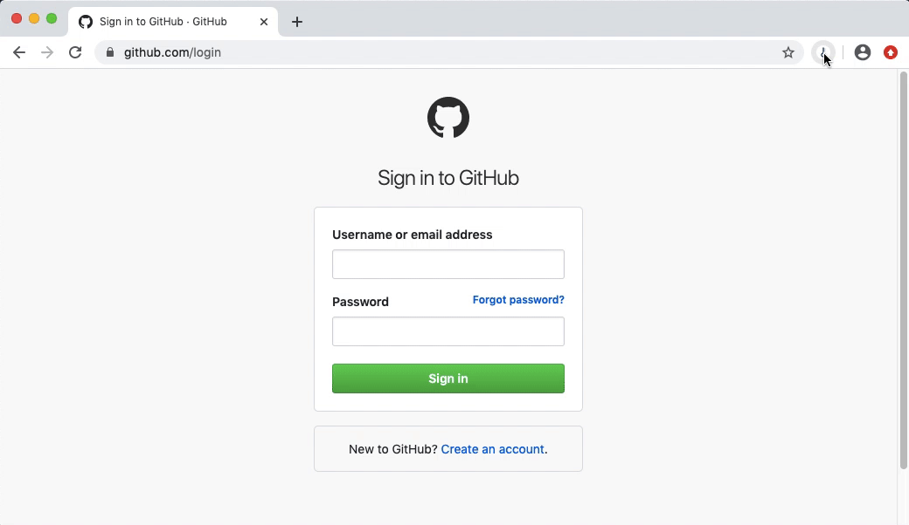

# Conjira

## Description
A chrome extension, alternative account auto-filling tool.

## Use development version
1. download the built [conjira.zip](https://github.com/lanzhiping/conjira/blob/master/dist/conjira.zip), and unzip it.

2. open extension management in Chrome `chrome://extensions`, and turn on development mode.

3. click 'Load unpacked' button and select the conjira unzip folder

## About me
[My github page](https://lanzhiping.github.io)
